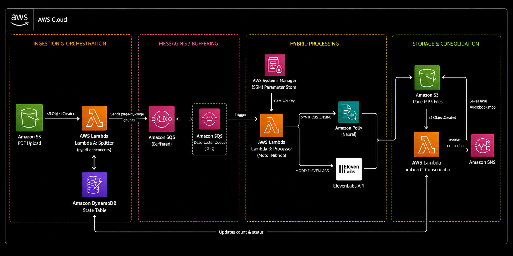

# 🎧 AWS Serverless AI Audiobook Pipeline

A serverless, event-driven application that transforms PDF books into high-quality MP3 audiobooks using native AWS services.

This project was built to solve a real personal problem: consuming educational content while driving or during activities where reading is impractical.

Besides solving that problem, it demonstrates modern AWS architecture using Infrastructure as Code (Terraform), Event-Driven Architecture, and Generative AI with Amazon Bedrock.

---

# Project Goals

This project has two main objectives.

## Functional Goal

Convert PDF books into high-quality audiobooks automatically.

## Engineering Goal

Demonstrate practical experience with:

- AWS Serverless
- Event-Driven Architecture
- Infrastructure as Code (Terraform)
- Amazon Bedrock
- Amazon Polly
- Cloud Engineering best practices

The project intentionally prioritizes simplicity, maintainability and native AWS services over unnecessary complexity.

---

# Architecture Overview



## AWS Services

- Amazon S3
- AWS Lambda
- Amazon SQS
- Amazon DynamoDB
- Amazon Bedrock
- Amazon Polly
- Amazon SNS
- AWS IAM
- Terraform

---

# Architecture Flow

```text
                Upload PDF
                     │
                     ▼
            Amazon S3 (Input)
                     │
                     ▼
           Lambda Splitter
                     │
        Extract PDF Text (PyPDF)
                     │
                     ▼
      Amazon Bedrock (Page Curation)
                     │
     KEEP / DISCARD each page
                     │
                     ▼
      Register Book in DynamoDB
                     │
                     ▼
          Fan-Out via Amazon SQS
                     │
                     ▼
         Lambda Processor
                     │
                     ▼
          Amazon Polly (TTS)
                     │
                     ▼
        S3 Intermediate MP3 Files
                     │
                     ▼
       Lambda Consolidator
                     │
                     ▼
      Final Audiobook (.mp3)
                     │
                     ▼
         Amazon SNS Notification
```

---

# How the Pipeline Works

## 1. Upload

The user uploads a PDF into the input S3 bucket.

This automatically triggers the Splitter Lambda.

---

## 2. Text Extraction

The Splitter extracts the text from every PDF page using PyPDF.

---

## 3. AI Page Curation

Each page is analyzed by Amazon Bedrock.

Pages that contain only:

- indexes
- blank pages
- copyright notices
- structural content

are discarded.

Only meaningful reading content continues through the pipeline.

---

## 4. Fan-Out Processing

Each valid page becomes an independent SQS message.

This allows AWS Lambda to process pages in parallel.

---

## 5. Speech Synthesis

Lambda Processor sends every page to Amazon Polly.

Polly generates one MP3 file per page.

---

## 6. Consolidation

Every generated MP3 is stored in Amazon S3.

When all pages are available:

- Lambda Consolidator joins every MP3
- Creates the final audiobook
- Stores the final file
- Sends an SNS notification

---

# AWS Architecture Patterns

This project demonstrates several common AWS architectural patterns.

- Event-Driven Architecture
- Fan-Out Processing
- Fan-In Aggregation
- Serverless Computing
- Infrastructure as Code
- Asynchronous Processing
- AI-assisted Content Processing

---

# Tech Stack

## Cloud

- AWS

## Infrastructure

- Terraform

## Programming Language

- Python 3.12

## AWS Services

- Amazon S3
- AWS Lambda
- Amazon SQS
- Amazon DynamoDB
- Amazon Bedrock
- Amazon Polly
- Amazon SNS
- IAM

---

# Security

The project follows AWS security best practices.

- Principle of Least Privilege (IAM)
- No hardcoded credentials
- Serverless architecture
- Dedicated IAM Roles
- Resource-specific permissions

---

# Cost Optimization

The architecture uses only pay-per-use AWS services.

Main optimization strategies include:

- Serverless compute (Lambda)
- DynamoDB On-Demand
- SQS buffering
- Amazon Polly pay-per-request
- Amazon Bedrock only during page classification

No infrastructure runs continuously.

---

# Repository Structure

```text
.
├── src/
│   ├── lambda_splitter/
│   ├── lambda_processor/
│   └── lambda_consolidator/
│
├── img/
│
├── docs/
│
├── lambda.tf
├── iam.tf
├── s3.tf
├── sqs.tf
├── dynamodb.tf
├── sns.tf
└── README.md
```

---

# Deploy

## Requirements

- Terraform >= 1.5
- Python 3.12
- AWS CLI configured

---

## Clone

```bash
git clone https://github.com/DevDan7/aws-serverless-audiobook-pipeline.git

cd aws-serverless-audiobook-pipeline
```

---

## Install Dependencies

```bash
cd src/lambda_splitter

pip install pypdf -t .

cd ../..
```

---

## Deploy

```bash
terraform init

terraform plan

terraform apply
```

---

## Test

1. Upload a PDF.

2. Monitor CloudWatch logs.

3. Verify:

- DynamoDB status
- SQS messages
- Generated MP3 pages
- Final audiobook
- SNS notification

---

# Lessons Learned

Building this project provided hands-on experience with:

- Event-Driven Architecture
- AWS Serverless Design
- Terraform
- Infrastructure as Code
- Amazon Bedrock
- Amazon Polly
- AWS IAM
- Distributed Processing
- AI-assisted document workflows

More importantly, it reinforced a core engineering principle:

> Build the simplest architecture that correctly solves the business problem.

---

# Future Improvements

Possible future enhancements include:

- S3 Lifecycle Rules for temporary files.
- CloudWatch dashboards and alarms.
- Automated CI/CD pipeline.
- Automated testing.

These improvements are intentionally outside the scope of version 1.0.

---

# Author

**Daniel Villegas**

Cloud Engineer

AWS Certified

Building practical serverless solutions with AWS.

LinkedIn:
https://www.linkedin.com/in/vdaniel07/

GitHub:
https://github.com/DevDan7 